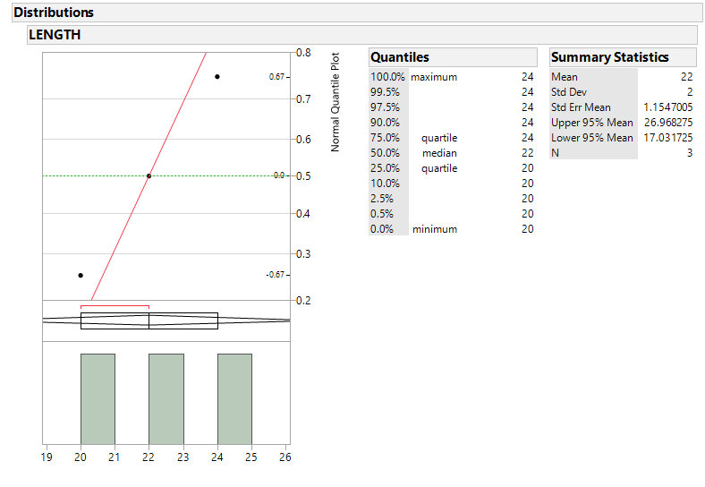
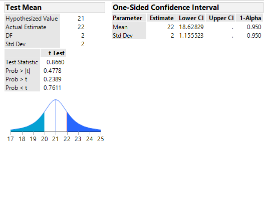

Spencer Retcher
[sretcher.github.io](https://github.com/sretcher/sretcher.github.io)

# One Sample Means T-Test

A marine biologist believes that great white sharks off the coast of Bermuda grow much longer due to unusual feeding habits. Three adult great white sharks around Bermuda were captured and their lengths were measured to test this claim. We will use a t-test to see if the true mean length of great white shark around Bermuda is more than 21 ft, which is the average length of all great white sharks.

A t-test is used to make inferences about a population mean of a normal distribution with a small sample size. In order to use a t-test, we must check that all assumptions have been met.

## Conditions for Small Sample T-Test

1. A random sample from the target population.
2. The population from which a sample is selected has a normal distribution.

Since the great white sharks were randomly captured around Bermuda, we will consider the first assumption to be met. In order to see if our data comes from a normal distribution, we will use a histogram and a normal quantile plot.



Looking at the plots above, we can see that the data is from a normal population. The data in the histogram is symmetric and the data points fall close to the line in the normal quantile plot. We also get a nice overview of data from the summary statistics/quantiles table.

## T-Test

Ho: u = 21

Ha: u > 21

where u is the true mean length of great white sharks around Bermuda. We are testing whether u is greater than 21 ft with a level of significance of 0.05



Using the p-value specified in the direction of the alternative hypothesis, we do not reject the null hypothesis since 0.2389 > 0.05. Using a rejection region, we do not reject the null hypothesis since 0.8660 (our t-statistic) < 2.920 (critical value). 

We do not have enough evidence to prove that the true mean length of great white sharks around Bermuda is more than 21 ft. We are 95% confident that the lowest value our parameter could be is 18.62829 ft. 


## Doing the Test in R
```
sharks <- read.csv("SHARK.csv",header = TRUE)

# Same Histogram and QQplot as Above
hist(sharks$LENGTH)
qqnorm(sharks$LENGTH)
qqline(sharks$LENGTH)

t.test(x = sharks$LENGTH,alternative = "greater",mu = 21,conf.level = .95)

### One Sample t-test

### data:  sharks$LENGTH
### t = 0.86603, df = 2, p-value = 0.2389
### alternative hypothesis: true mean is greater than 21
### 95 percent confidence interval:
### 18.62829      Inf
### sample estimates:
### mean of x 
###    22 
```


